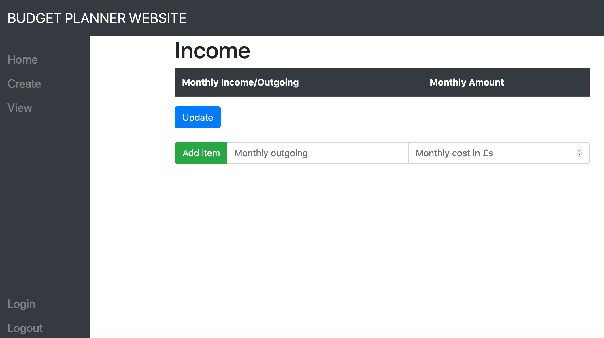
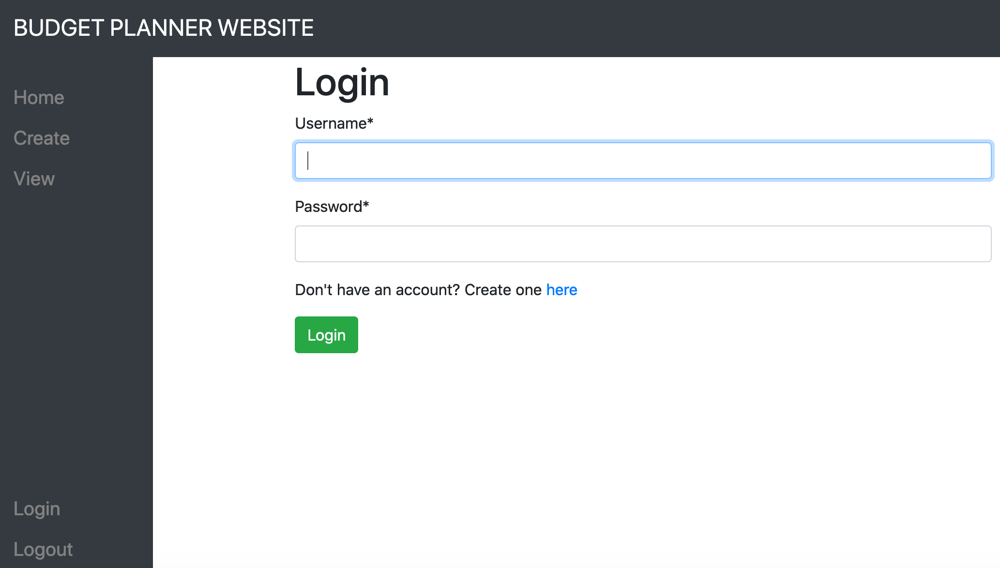

# django_budget_website

### django notes
    - django-admin startproject <site name> -> creates a variety of files for your project
    - python3 manage.py runserver -> to run the project
    - python3 manage.py migrate -> creates neccessary database tables
    - python3 manage.py makemigrations -> store the changes made as a migration
    - python3 manage.py migrate --run-syncdb -> table_not_found error, try this

### how to run the django application
1. git clone **this repo url**
2. python3 -m venv venv/ 
    - Creates an environment called venv/ you can replace “venv/” with a different name for your environment
5. source venv/bin/activate
    - activate the virtual envrionment
4. pip install -r requirements.txt
5. cd mysite
    - changes directory to directory with manage.py.
6. python3 manage.py migrate
    - migrate changes to create models
7. python3 manage.py makemigrations
    - store the changes
8. python3 manage.py migrate --run-syncdb
    - sync database
9. python3 manage.py runserver
    - run the server on http://127.0.0.1:8000/ 

### screenshot examples :

